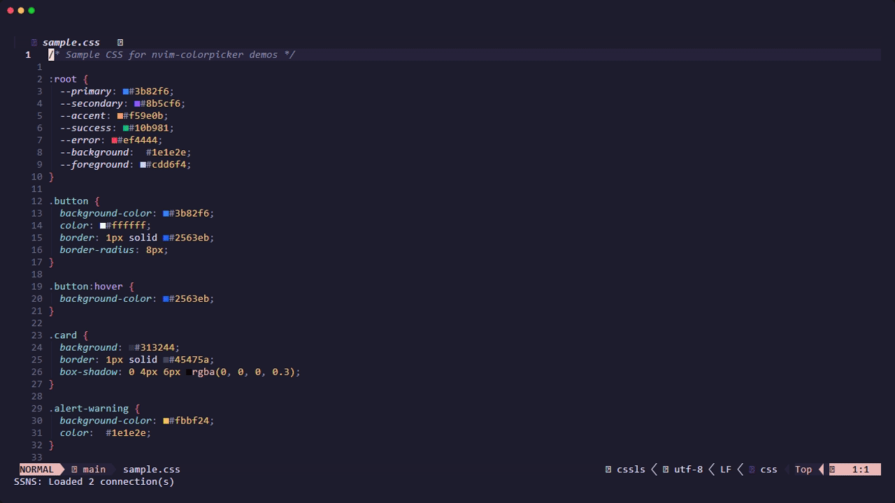
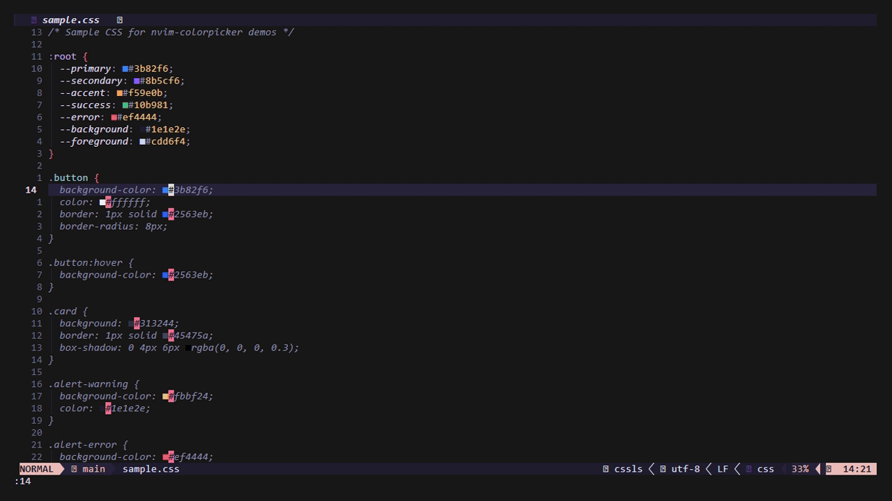
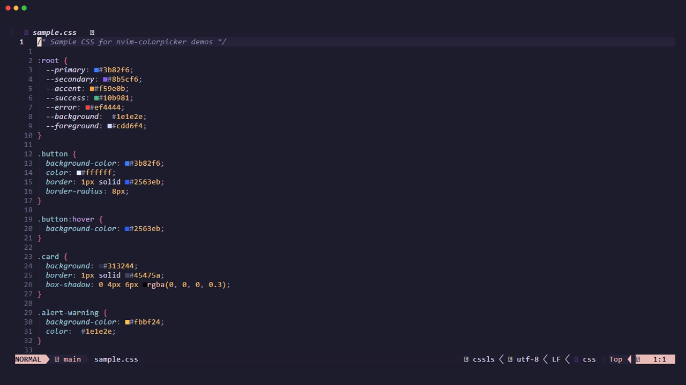
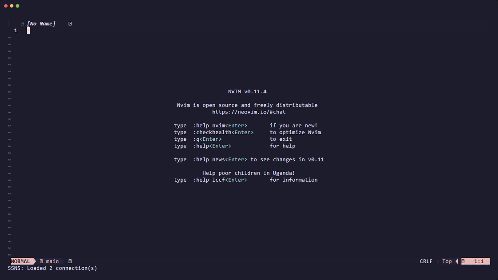
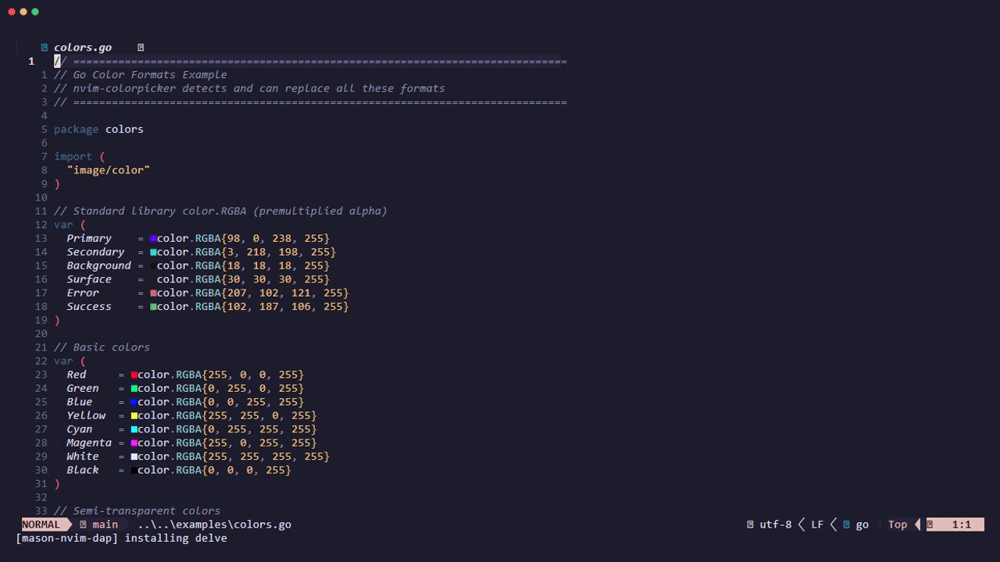

# nvim-colorpicker

A powerful HSL-based color picker for Neovim with visual grid navigation, multiple picker interfaces, real-time preview and more.

**Version:** 2.1.0

<p align="center">
  
</p>

## Features

- **HSL Color Grid** - Interactive visual grid for selecting hue and lightness with vim-style navigation
- **Multiple Picker Interfaces** - Full multipanel picker with tabs, compact mini picker, and slider mode
- **Multi-Language Support** - Detect colors in 12+ languages: CSS, JS/TS, Go, C++, Rust, Kotlin, Swift, Dart, C#, Python, Lua, GLSL/HLSL
- **Language-Aware Formatting** - Output colors in native format (QColor, color.RGBA, vec3, etc.)
- **Custom Color Patterns** - Define your own color functions and classes for detection
- **Color Detection** - Automatically detect and replace colors in HEX, RGB, HSL, HSLA formats
- **Buffer Highlighting** - Real-time color highlighting in your code (background, foreground, or virtualtext)
- **Rich Preset Library** - 600+ colors from Web, Material, and Tailwind palettes
- **Alpha Channel Support** - Full opacity editing with visual feedback
- **Keyboard Layout Aware** - Auto-detects Colemak/Dvorak and custom movement remaps
- **Format Intelligent** - Preserves original color format on replacement

## Requirements

- **Neovim:** >= 0.9.0
- **Dependencies:** [nvim-float](https://github.com/mikevskater/nvim-float)
- **Recommended:** `termguicolors` enabled for accurate color display

## Installation

### lazy.nvim (Recommended)

```lua
-- Minimal (uses defaults)
{
  "mikevskater/nvim-colorpicker",
  dependencies = { "mikevskater/nvim-float" },
  opts = {},
}

-- With custom options (recommended)
{
  "mikevskater/nvim-colorpicker",
  dependencies = { "mikevskater/nvim-float" },
  opts = {
    alpha_enabled = true,
    highlight = {
      enable = true,
      filetypes = { "css", "scss", "html" },
    },
  },
}

-- With lazy-loading on command
{
  "mikevskater/nvim-colorpicker",
  dependencies = { "mikevskater/nvim-float" },
  cmd = { "ColorPicker", "ColorPickerAtCursor", "ColorPickerMini" },
  opts = {},
}

-- Full example with keymaps (using <Plug> mappings)
{
  "mikevskater/nvim-colorpicker",
  dependencies = { "mikevskater/nvim-float" },
  cmd = { "ColorPicker", "ColorPickerMini", "ColorHighlight" },
  keys = {
    { "<leader>cp", "<Plug>(colorpicker)", desc = "Color Picker" },
    { "<leader>cc", "<Plug>(colorpicker-at-cursor)", desc = "Pick at Cursor" },
    { "<leader>cm", "<Plug>(colorpicker-mini)", desc = "Mini Picker" },
    { "<leader>ch", "<Plug>(colorpicker-highlight-toggle)", desc = "Toggle Highlighting" },
  },
  opts = {
    alpha_enabled = true,
    presets = { "web", "tailwind" },
  },
}
```

> **Note:** When using `opts`, lazy.nvim automatically calls `require("nvim-colorpicker").setup(opts)` for you.

### packer.nvim

```lua
use {
  "mikevskater/nvim-colorpicker",
  requires = { "mikevskater/nvim-float" },
  config = function()
    require("nvim-colorpicker").setup()
  end,
}
```

### Health Check

After installation, verify everything is working:

```vim
:checkhealth nvim-colorpicker
```

## Quick Start

```lua
-- Minimal setup (uses defaults)
require("nvim-colorpicker").setup()

-- Open full picker
vim.keymap.set("n", "<leader>cp", "<cmd>ColorPicker<cr>")

-- Pick color at cursor
vim.keymap.set("n", "<leader>cc", "<cmd>ColorPickerAtCursor<cr>")

-- Mini picker
vim.keymap.set("n", "<leader>cm", "<cmd>ColorPickerMini<cr>")
```

<p align="center">
  
</p>

## Configuration

<details>
<summary>Full Default Configuration</summary>

```lua
require("nvim-colorpicker").setup({
  -- Default color output format: "hex", "rgb", "hsl", "hsv"
  default_format = "hex",

  -- Hex color case: "upper" or "lower"
  hex_case = "upper",

  -- Enable alpha channel editing by default
  alpha_enabled = false,

  -- Number of recent colors to track in history
  recent_colors_count = 10,

  -- Preset palettes to include: {"web", "material", "tailwind"}
  presets = {},

  -- Auto-detect movement keys from global Neovim keymaps
  -- Useful for Colemak, Dvorak, and other keyboard layouts
  inherit_movement_keys = true,

  -- Inline color highlighting configuration
  highlight = {
    -- Enable auto-highlighting on buffer enter
    enable = false,

    -- Filetypes to enable: "*" for all, or list like {"css", "html", "lua"}
    filetypes = "*",

    -- Filetypes to exclude from highlighting
    exclude_filetypes = {
      "lazy", "mason", "help", "TelescopePrompt",
      "nvim-float", "nvim-float-form", "nvim-float-interactive",
      "nvim-colorpicker-grid", "nvim-colorpicker-info",
    },

    -- Highlight display mode: "background", "foreground", "virtualtext"
    mode = "background",

    -- Character for virtualtext swatch (e.g., "●", "▓", "█", "◼")
    swatch_char = "■",
  },

  -- Keymap configuration
  keymaps = {
    -- Grid navigation (hue and lightness)
    nav_left = "h",
    nav_right = "l",
    nav_up = "k",
    nav_down = "j",

    -- Saturation adjustment
    sat_up = "K",
    sat_down = "J",

    -- Step size adjustment
    step_down = "-",
    step_up = { "+", "=" },

    -- Actions
    reset = "r",
    hex_input = "#",
    apply = "<CR>",
    cancel = { "q", "<Esc>" },
    help = "?",

    -- Mode and format cycling
    cycle_mode = "m",
    cycle_format = "f",

    -- Alpha adjustment
    alpha_up = "A",
    alpha_down = "a",

    -- Panel focus (full picker)
    focus_next = "<Tab>",
    focus_prev = "<S-Tab>",
  },
})
```

</details>

### Common Configurations

**Enable Auto-Highlighting for Web Files:**

```lua
require("nvim-colorpicker").setup({
  highlight = {
    enable = true,
    filetypes = { "css", "scss", "html", "vue", "svelte", "jsx", "tsx" },
    mode = "background",
  },
})
```

**Load All Color Presets:**

```lua
require("nvim-colorpicker").setup({
  presets = { "web", "material", "tailwind" },
})
```

**Enable Alpha Editing by Default:**

```lua
require("nvim-colorpicker").setup({
  alpha_enabled = true,
})
```

**Define Custom Color Patterns:**

```lua
require("nvim-colorpicker").setup({
  custom_patterns = {
    -- Add patterns for specific filetypes
    cpp = {
      {
        pattern = "MyColor%s*%(%s*%d+%s*,%s*%d+%s*,%s*%d+%s*%)",
        format = "my_color_rgb",
        priority = 100,  -- Higher = checked first
        parse = function(match)
          local r, g, b = match:match("MyColor%s*%(%s*(%d+)%s*,%s*(%d+)%s*,%s*(%d+)%s*%)")
          if r and g and b then
            return string.format("#%02X%02X%02X", tonumber(r), tonumber(g), tonumber(b))
          end
        end,
        format_color = function(hex, alpha)
          local r = tonumber(hex:sub(2, 3), 16)
          local g = tonumber(hex:sub(4, 5), 16)
          local b = tonumber(hex:sub(6, 7), 16)
          return string.format("MyColor(%d, %d, %d)", r, g, b)
        end,
      },
    },
    -- "_all" applies to all filetypes
    _all = {
      {
        pattern = "theme%.color%s*=%s*\"#%x%x%x%x%x%x\"",
        format = "theme_color",
        parse = function(match)
          return match:match("\"(#%x%x%x%x%x%x)\"")
        end,
        format_color = function(hex)
          return string.format('theme.color = "%s"', hex)
        end,
      },
    },
  },
})
```

## Commands

### Color Picker Commands

| Command | Description |
|---------|-------------|
| `:ColorPicker [color]` | Open full color picker. Inserts selected color at cursor. |
| `:ColorPickerAtCursor` | Detect color at cursor, open picker, replace on confirm. |
| `:ColorPickerMini [color]` | Open compact inline picker. Inserts selected color at cursor. |
| `:ColorPickerMiniAtCursor` | Detect color at cursor, open mini picker for replacement. |
| `:ColorPickerMiniSlider [color]` | Open mini picker in slider mode. Inserts selected color at cursor. |
| `:ColorPickerMiniSliderAtCursor` | Detect color at cursor, open mini slider for replacement. |

### Conversion and Clipboard Commands

| Command | Description |
|---------|-------------|
| `:ColorConvert [format]` | Convert color at cursor (preserves alpha). Formats: `hex`, `rgb`, `hsl`, `hsv`. |
| `:ColorYank [format]` | Copy color at cursor to clipboard. |
| `:ColorPaste` | Paste color from clipboard and insert at cursor. |

### Highlighting Commands

| Command | Description |
|---------|-------------|
| `:ColorHighlight` | Toggle color highlighting in current buffer. |
| `:ColorHighlight on` | Enable highlighting in current buffer. |
| `:ColorHighlight off` | Disable highlighting in current buffer. |
| `:ColorHighlight auto` | Enable auto-highlighting for configured filetypes. |
| `:ColorHighlight background` | Set highlight mode to background. |
| `:ColorHighlight foreground` | Set highlight mode to foreground. |
| `:ColorHighlight virtualtext` | Set highlight mode to virtualtext. |

### Other Commands

| Command | Description |
|---------|-------------|
| `:ColorHistory [count]` | Display recent colors (default: 10). |
| `:ColorSearch <query>` | Search presets by color name. |
| `:ColorPickerTest` | Run tests and show results in UI. |

### `<Plug>` Mappings

For users who prefer to create their own keymaps:

| Plug Mapping | Description |
|--------------|-------------|
| `<Plug>(colorpicker)` | Open full color picker |
| `<Plug>(colorpicker-at-cursor)` | Pick and replace color at cursor |
| `<Plug>(colorpicker-mini)` | Open mini color picker |
| `<Plug>(colorpicker-mini-at-cursor)` | Mini picker at cursor |
| `<Plug>(colorpicker-slider)` | Open picker in slider mode |
| `<Plug>(colorpicker-slider-at-cursor)` | Slider mode at cursor |
| `<Plug>(colorpicker-convert-hex)` | Convert color at cursor to hex |
| `<Plug>(colorpicker-convert-rgb)` | Convert color at cursor to rgb |
| `<Plug>(colorpicker-convert-hsl)` | Convert color at cursor to hsl |
| `<Plug>(colorpicker-highlight-toggle)` | Toggle buffer highlighting |

**Example:**

```lua
vim.keymap.set("n", "<leader>cp", "<Plug>(colorpicker)")
vim.keymap.set("n", "<leader>cc", "<Plug>(colorpicker-at-cursor)")
vim.keymap.set("n", "<leader>cm", "<Plug>(colorpicker-mini)")
vim.keymap.set("n", "<leader>ch", "<Plug>(colorpicker-highlight-toggle)")
```

## Keymaps

### Grid Navigation

| Keys | Action |
|------|--------|
| `h` / `l` | Adjust hue (left/right) |
| `j` / `k` | Adjust lightness (down/up) |
| `J` / `K` | Adjust saturation (less/more) |
| `[count]` | Use count prefix: `10h`, `50k` |

### Step Size Control

| Keys | Action |
|------|--------|
| `-` / `+` | Decrease/increase step multiplier |

### Color Mode

| Keys | Action |
|------|--------|
| `m` | Cycle mode: HEX → HSL → RGB → HSV → CMYK |
| `f` | Toggle format: standard/decimal |
| `o` | Cycle output format (language-aware) |

### Actions

| Keys | Action |
|------|--------|
| `#` | Enter hex color manually |
| `r` | Reset to original |
| `Enter` | Apply and close |
| `q` / `Esc` | Cancel and close |
| `?` | Show help |

### Tab Navigation (Full Picker)

| Keys | Action |
|------|--------|
| `g1` | Info tab (sliders) |
| `g2` | History tab |
| `g3` | Presets tab |
| `Tab` / `S-Tab` | Focus next/previous panel |

### Mini Picker

| Keys | Action |
|------|--------|
| `s` | Toggle between grid and slider mode |
| `a` / `A` | Decrease/increase alpha (if enabled) |

<details>
<summary>Mini Picker Demo</summary>
<p align="center">
  
</p>
</details>

<details>
<summary>Slider Mode Demo</summary>
<p align="center">
  
</p>
</details>

## Lua API

```lua
local colorpicker = require("nvim-colorpicker")
```

### Main Functions

```lua
-- Open picker with options
colorpicker.pick({
  color = "#ff5500",
  alpha_enabled = true,
  target_filetype = "go",        -- Format output for Go (optional)
  original_format = "color_rgba", -- Preserve original format (optional)
  on_select = function(result)
    print("Selected: " .. result.color)  -- Formatted for filetype
    print("Raw hex: " .. result.hex)     -- Always #RRGGBB
  end,
  on_cancel = function()
    print("Cancelled")
  end,
  on_change = function(result)
    -- Live preview on every change
  end,
})

-- Pick color at cursor
colorpicker.pick_at_cursor()

-- Mini picker
colorpicker.pick_mini({ color = "#ff0000" })
colorpicker.pick_mini_at_cursor()

-- Slider mode
colorpicker.pick_mini_slider({ color = "#3366ff" })

-- Get/set color in open picker
local current = colorpicker.get_color()
colorpicker.set_color("#00ff00", "#ff0000")  -- new, original

-- Check picker state
if colorpicker.is_open() then ... end
if colorpicker.is_mini_open() then ... end
```

### Highlighting

```lua
colorpicker.toggle_highlight()
colorpicker.enable_highlight()
colorpicker.disable_highlight()
colorpicker.enable_auto_highlight({ "*.css", "*.scss" })
colorpicker.set_highlight_mode("virtualtext")
```

<details>
<summary>Highlighting Modes Demo</summary>
<p align="center">
  
</p>
</details>

### History and Clipboard

```lua
colorpicker.yank("#ff5500", "rgb")  -- Copies: rgb(255, 85, 0)
colorpicker.yank()                  -- Yank color at cursor
local color = colorpicker.paste()
local recent = colorpicker.get_recent_colors(5)
colorpicker.add_recent_color("#00ff00")
```

### Utilities

```lua
local utils = colorpicker.utils()
local r, g, b = utils.hex_to_rgb("#ff5500")
local hex = utils.rgb_to_hex(255, 85, 0)
```

## External Plugin Integration

nvim-colorpicker can be integrated into other plugins using callbacks. This example shows [SSNS Theme Editor](https://github.com/mikevskater/ssns) using the colorpicker with custom controls for foreground/background toggle and bold/italic styling.

<details>
<summary>External Plugin Integration Demo</summary>
<p align="center">
  
</p>

The demo shows:
1. Opening the SSNS Theme Editor.
2. Navigating to a theme item ("databases").
3. Opening the colorpicker to edit colors.
4. Adjusting foreground color via the HSL grid.
5. Pressing `B` to switch to background color mode.
6. Adjusting background color and saturation.
7. Toggling `i` (italic) and `b` (bold) custom controls.
8. Applying changes back to the theme editor with the passed callback.
</details>

### Basic Integration

```lua
local colorpicker = require("nvim-colorpicker")

colorpicker.pick({
  color = initial_color,
  title = "Edit Color",

  -- Called on every color change (live preview)
  on_change = function(result)
    update_preview(result.color)
  end,

  -- Called when user confirms (Enter)
  on_select = function(result)
    save_color(result.color)
  end,

  -- Called when user cancels (Escape)
  on_cancel = function()
    restore_original()
  end,
})
```

### Custom Controls

Inject custom UI controls for advanced use cases:

```lua
colorpicker.pick({
  custom_controls = {
    {
      id = "target",
      type = "select",
      label = "Target",
      options = { "fg", "bg" },
      default = "fg",
      key = "B",  -- Press B to switch
      on_change = function(new_value, old_value)
        -- Handle target switch
      end,
    },
    {
      id = "bold",
      type = "toggle",
      label = "Bold",
      default = false,
      key = "b",
    },
  },
  on_select = function(result)
    local target = result.custom.target
    local bold = result.custom.bold
    -- Use custom values...
  end,
})
```

**Control Types:**
- `toggle` - Boolean on/off
- `select` - Cycle through options
- `number` - Numeric value with min/max/step
- `text` - Text input

### Programmatic Control

```lua
-- Update picker color externally
if colorpicker.is_open() then
  colorpicker.set_color("#00ff00", "#ff0000")
end

-- Get current selection
local current = colorpicker.get_color()
```

## UI Components

### Full Picker Layout

```
┌─────────────────────────────────────────────────────────────┐
│  #FF5500 HSL 20° 100% 50% Step: 1x                        │
├────────────────────────────────┬────────────────────────────┤
│                                │  [Info] [History] [Presets]│
│         Color Grid (HSL)       │                            │
│ ██████████████████████████████ │  H: ████████░░░░  20°      │
│ ██████████████████████████████ │  S: ████████████  100%     │
│ ██████████████x ← cursor██████ │  L: ██████░░░░░░  50%      │
│ ██████████████████████████████ │  A: ████████████  100%     │
│ ██████████████████████████████ │                            │
│                                │                            │
├────────────────────────────────│                            │
│───Original────┬────Current──── │                            │
│███████████████│███████████████ │                            │
└────────────────────────────────┴────────────────────────────┘
```

### Mini Picker Layout

```
┌─ #FF5500 HSL Step: 1x ────────────────┐
│                                         │
│     Color Grid (compact)                │
│              x                          │
│                                         │
│                                         │
├──────Original──────┬──────Current───────┤
│████████████████████│████████████████████│
└─────────────────────────────────────────┘
```

### Mini Picker Slider Layout

```
┌─ #FF5500 HSL Step: 1x ────────────────┐
│                                         │
│  H: ████████░░░░  20°                   │
│  S: ████████████  100%                  │
│  L: ██████░░░░░░  50%                   │
│                                         │
├──────Original──────┬──────Current───────┤
│████████████████████│████████████████████│
└─────────────────────────────────────────┘
```

## Color Format Support

### Universal Formats

| Format | Pattern | Example |
|--------|---------|---------|
| HEX (6-digit) | `#RRGGBB` | `#FF5500` |
| HEX (3-digit) | `#RGB` | `#F50` |
| HEX (8-digit) | `#RRGGBBAA` | `#FF550080` |
| RGB | `rgb(r, g, b)` | `rgb(255, 85, 0)` |
| RGBA | `rgba(r, g, b, a)` | `rgba(255, 85, 0, 0.5)` |
| HSL | `hsl(h, s%, l%)` | `hsl(20, 100%, 50%)` |
| HSLA | `hsla(h, s%, l%, a)` | `hsla(20, 100%, 50%, 0.5)` |
| Vim highlight | `guifg=#RRGGBB` | `guifg=#FF5500` |

### Language-Specific Formats

<details>
<summary>Click to expand supported language formats</summary>

| Language | Formats Detected |
|----------|------------------|
| **CSS/SCSS/LESS** | `hex`, `rgb()`, `rgba()`, `hsl()`, `hsla()`, `hwb()`, `lab()`, `lch()`, `oklch()` |
| **JavaScript/TypeScript** | `hex`, `rgb()`, `hsl()`, `0xRRGGBB` |
| **Go** | `color.RGBA{r,g,b,a}`, `color.NRGBA{}`, `{r,g,b,a}`, `0xRRGGBB`, `0xAARRGGBB` |
| **C++/Qt** | `QColor("#hex")`, `QColor(r,g,b)`, `QColor::fromRgbF()`, `{r,g,b,a}`, `{0.5f,0.3f,0.1f}`, `0xRRGGBB` |
| **Rust** | `Color::rgb()`, `Color::rgba()`, `Color::srgb()`, `Srgba::new()`, `hex!()`, `0xRRGGBB` |
| **Kotlin/Android** | `Color(0xAARRGGBB)`, `Color.parseColor()`, `0xAARRGGBB` |
| **Swift/SwiftUI** | `Color(red:green:blue:)`, `UIColor()`, `NSColor()`, `#colorLiteral()` |
| **Dart/Flutter** | `Color(0xAARRGGBB)`, `Color.fromARGB()`, `Color.fromRGBO()`, `Colors.name` |
| **C#/Unity** | `Color(r,g,b,a)`, `Color32(r,g,b,a)`, `new Color()`, `Color.name` |
| **Python** | `(r,g,b)`, `(r,g,b,a)`, `pygame.Color()`, `hex` strings |
| **Lua/Love2D** | `{r,g,b}`, `{r,g,b,a}`, `love.graphics` colors |
| **GLSL/HLSL/Metal** | `vec3()`, `vec4()`, `float3()`, `float4()` |

</details>

<details>
<summary>Multi-Language Color Detection Demo</summary>
<p align="center">
  
</p>

The demo shows:
1. Detecting and editing `color.RGBA{}` in Go
2. Detecting and editing `QColor()` in C++
3. Detecting and editing float struct `{0.384f, 0.000f, 0.933f}` in C++
4. Detecting and editing `Color::srgb()` in Rust
</details>

<details>
<summary>Output Format Cycling Demo</summary>
<p align="center">
  
</p>

The demo shows:
1. Opening the picker on a Go `color.RGBA{}` color
2. Pressing `o` to cycle through available formats (color_rgba, color_nrgba, struct, hex_numeric, etc.)
3. Selecting a different output format before applying
4. The color is replaced using the selected format
</details>

<details>
<summary>Format Conversion Demo</summary>
<p align="center">
  
</p>
</details>

## Troubleshooting

### Colors Not Displaying Properly

Ensure `termguicolors` is enabled:

```lua
vim.opt.termguicolors = true
```

### Custom Keymaps Not Working

If using custom navigation keys, disable auto-detection:

```lua
require("nvim-colorpicker").setup({
  inherit_movement_keys = false,
  keymaps = { ... },
})
```

### Highlighting Appears in Wrong Buffers

Refine your exclude list:

```lua
highlight = {
  exclude_filetypes = {
    "lazy", "mason", "help", "TelescopePrompt",
    "NvimTree", "neo-tree", "dashboard", "alpha",
  },
}
```

## Testing

Run the built-in test suite:

```vim
:ColorPickerTest      " Show results in UI
:ColorPickerTest run  " Print to console
:ColorPickerTest last " Show previous results
```

## License

MIT [LICENSE](./LICENSE)

## Contributing

Contributions are welcome! Please feel free to submit a Pull Request.

## Support or Issues

If you encounter any issues or need support, please open an issue on the [GitHub repository](https://github.com/MikeVSkater/nvim-colorpicker/issues).
